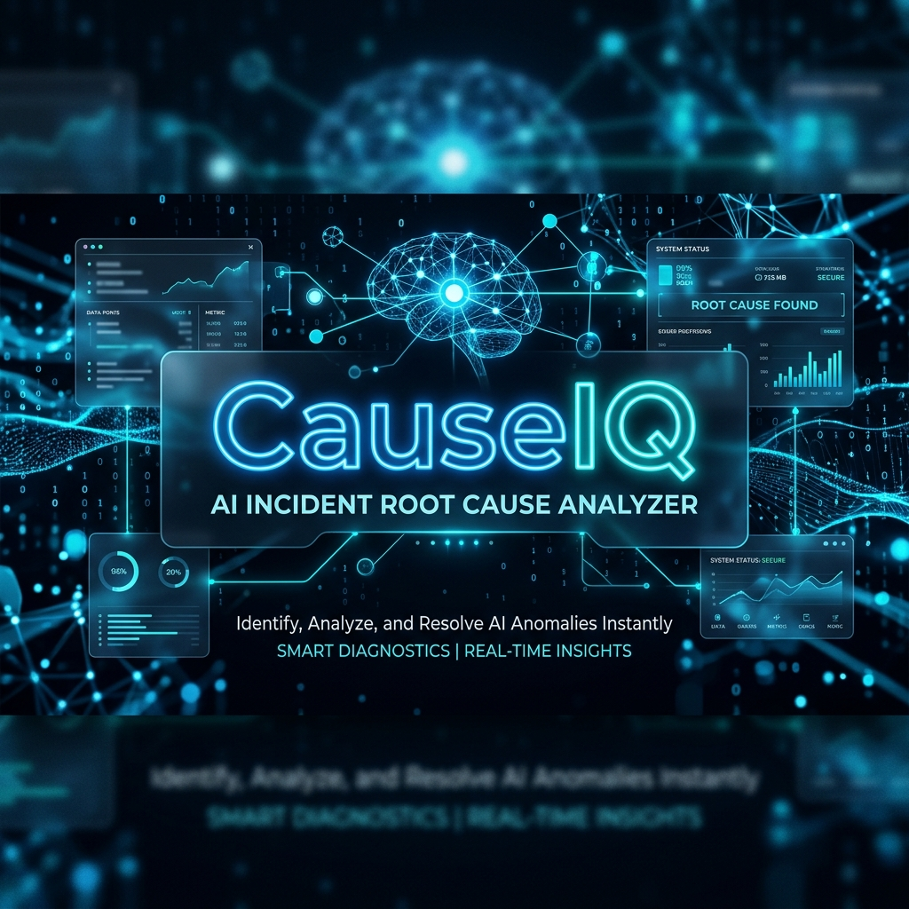
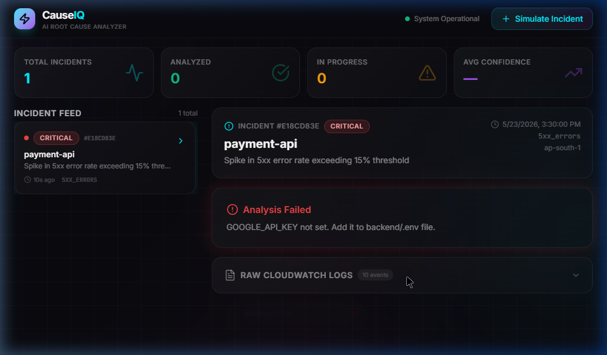
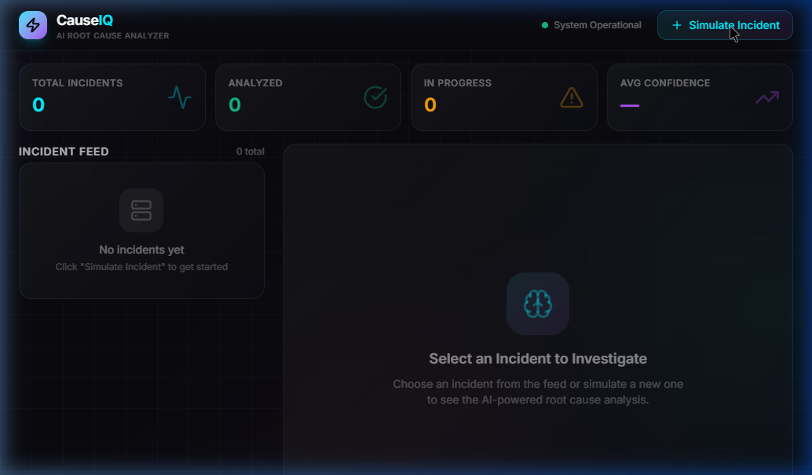
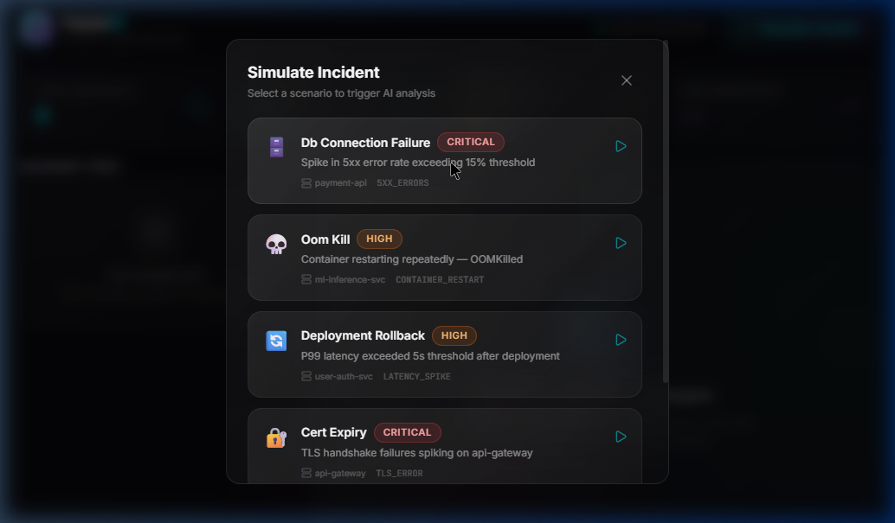
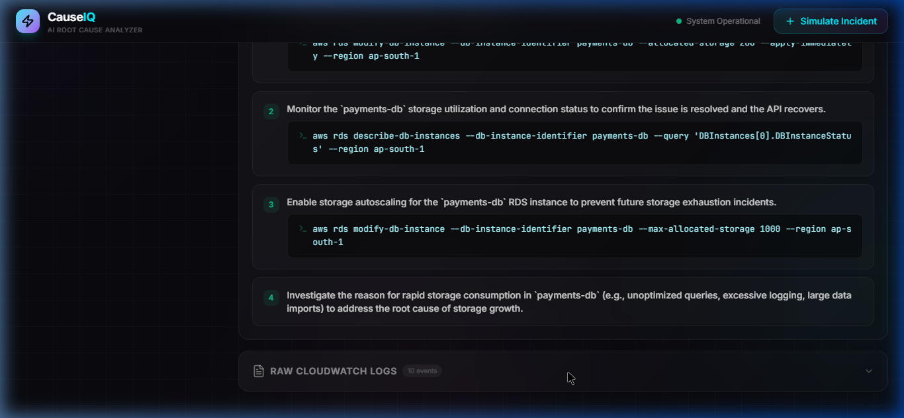
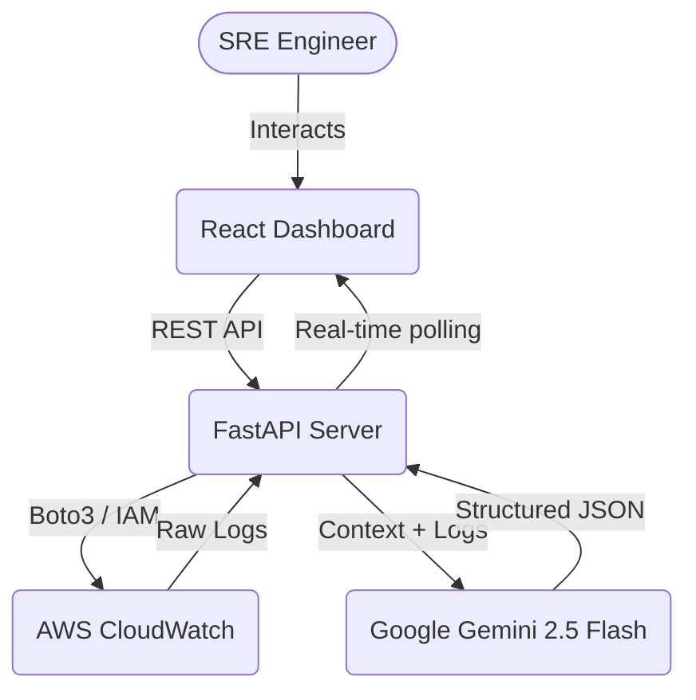

# CauseIQ — AI Incident Root Cause Analyzer

An advanced, SRE-focused web application that automatically integrates with **AWS CloudWatch** and the **Gemini 2.5 Flash** AI model to diagnose and provide actionable remediations for production incidents.

By seamlessly fetching your actual, live cloud logs and parsing them through an LLM trained to act as a senior SRE, CauseIQ cuts down Mean Time to Resolution (MTTR) from hours to seconds.

---

## 📸 Platform Overview

### 1. The Command Center
A unified, dark-themed, glassmorphic dashboard tracking all system anomalies and AI analysis statuses.


### 2. Live AWS Simulation Integration
Launch simulations directly connected to your live AWS Lambda and ECS environments.


### 3. Scenario Selection
We query your AWS account dynamically to let you test on real, live log groups (like `THE-GRAD-AnalyzeFunction`).


### 4. AI-Powered Root Cause & Remediation
Once an incident fires, Gemini streams back the timeline, root cause, and *exact CLI commands* to fix it.


---

## 🏗 System Architecture

CauseIQ operates on a robust, decoupled architecture designed for speed and reliability.



### The Data Flow
1. **Trigger:** An alert webhook hits the backend OR the user clicks "Simulate" in the UI.
2. **Fetch Logs:** The FastAPI backend securely connects to AWS via `boto3` and queries CloudWatch for the relevant time window around the incident.
3. **AI Pipeline:** The raw log dump and incident metadata are packaged into a sophisticated system prompt and sent to `gemini-2.5-flash`.
4. **Structured Output:** The AI acts under a strict `response_schema`, returning validated JSON containing:
   - Plain English root cause
   - Confidence score
   - Blast radius / impact analysis
   - Chronological timeline of the failure cascade
   - Step-by-step CLI remediation commands
5. **Real-time UI:** The React dashboard polls the backend and renders the findings the moment the AI completes its reasoning.

---

## 🛠 Tech Stack

- **Frontend:**
  - React 19 + TypeScript
  - Vite (Build Tool & Dev Server)
  - Tailwind CSS v4 (Styling engine)
  - Lucide React (Iconography)
- **Backend:**
  - Python 3.13 + FastAPI + Uvicorn
  - Boto3 (AWS SDK for CloudWatch integration)
  - Google GenAI SDK (`google-genai`)
- **AI / Cloud:**
  - **Google Gemini 2.5 Flash**: Optimized for rapid, structured data extraction.
  - **AWS CloudWatch**: Source of truth for all production telemetry.

---

## 🚀 Getting Started

### Prerequisites
- Python 3.10+
- Node.js 18+
- AWS CLI configured locally (`aws configure` with an active session)
- Google Gemini API Key

### Installation

1. **Clone the repository**
   ```bash
   git clone https://github.com/himshxrmx/CauselIQ.git
   cd CauselIQ
   ```

2. **Backend Setup**
   ```bash
   cd backend
   pip install -r requirements.txt
   cp .env.example .env
   ```
   *Edit `.env` and add your `GOOGLE_API_KEY`.*

3. **Frontend Setup**
   ```bash
   cd ../frontend
   npm install
   ```

### Running the Application

CauseIQ includes a unified startup script. From the root directory, simply run:

```bash
python run.py
```

This will concurrently launch the FastAPI server and the Vite frontend.
- **Dashboard:** http://localhost:5173
- **API Docs:** http://localhost:8000/docs

---

## 🔒 Security

- **No Log Storage:** CauseIQ processes logs purely in memory during the investigation phase. Logs are not persisted to a database.
- **Environment Variables:** API keys and sensitive tokens are strictly managed via `.env` files and `.gitignore`.
- **Read-Only AWS Access:** The backend only requires `logs:FilterLogEvents` permissions to operate.

## 📄 License
MIT License
